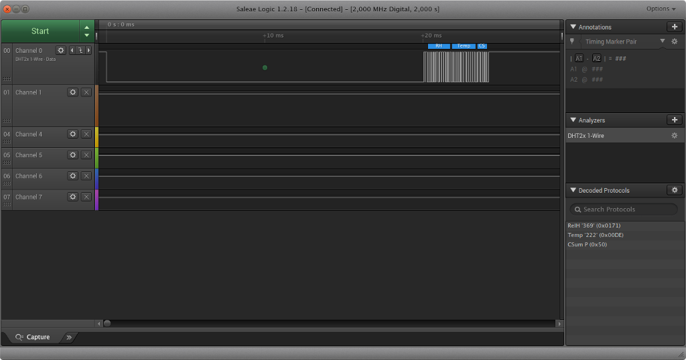

# DHT2x Protocol Analyzer for Saleae Logic
This plugin implements a 1-wire like decoder. Default timings are based on the datasheet. The decoder is a simple threshold detector which checks HIGH pulse duration. Anything above (One_duration+Zero_duration)/2 is considered 1 and below is 0. There is cehcking for the host start signal which is any LOW duration > 1 ms. The decoder expects a message length of 40 bits in total (not including the initial host/sensor hand shaking).

# Screenshot

# Build Instructions
To build on Linux, run the build_analyzer.py script. The compiled libraries can be found in the newly created debug and release folders.

	python build_analyzer.py

You will also need the 1.1.32 SDK, the latest SDK release. That is available on a separate branch of the Saleae AnalyzerSDK Github repository. Simply change the submodule configuration to point to that branch.

>**Note:** I had to add "-std=c++11" to the compile options so the project would build without errors!
